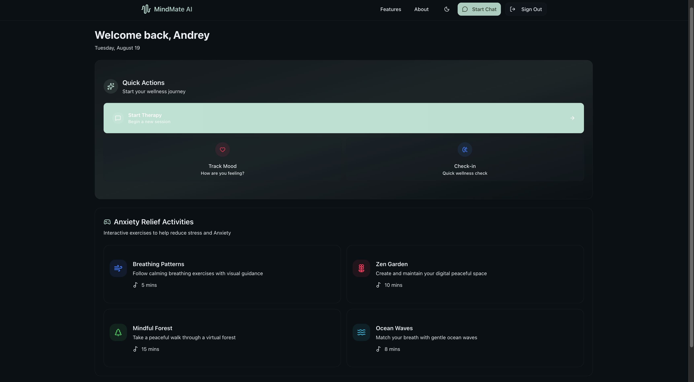
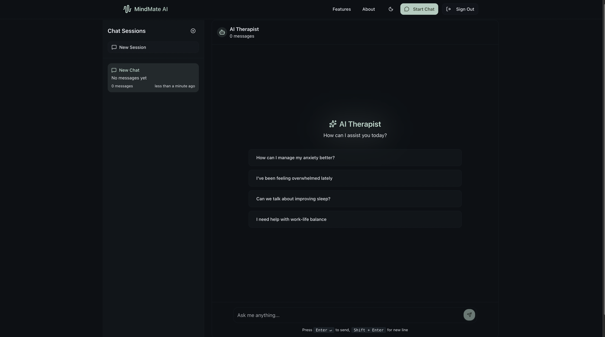
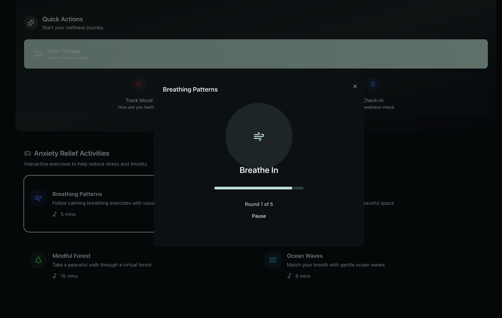
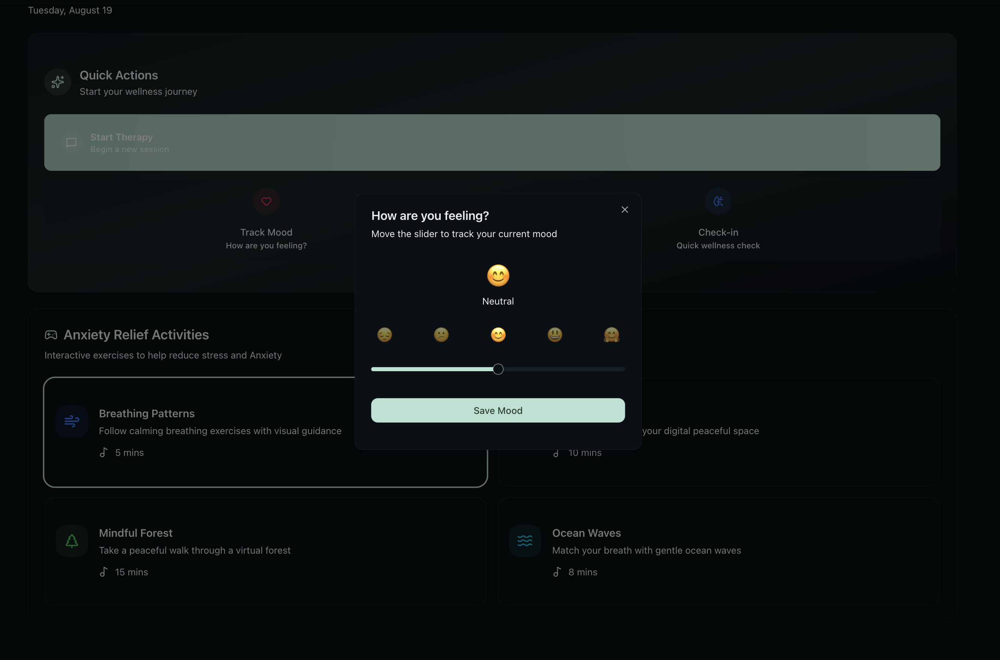

# MindMate AI

[](https://nextjs.org/)
[](https://www.typescriptlang.org/)
[](https://nodejs.org/)
[](https://expressjs.com/)
[](https://mongodb.com/)
[](https://ai.google.dev/)
[](https://jwt.io/)
[](https://restfulapi.net/)
[](https://vercel.com/)
[](https://render.com/)

> A revolutionary full-stack AI therapy platform that provides personalized mental health support through intelligent conversations, advanced emotion detection, and evidence-based therapeutic techniques. Built with cutting-edge technology for maximum privacy, security, and effectiveness.

## 🌐 Live Demo

**🚀 [Experience MindMate AI Live →](https://mindmate-ai-platform.vercel.app/)**

*Experience the future of mental health support - available 24/7, private, and personalized just for you.*

---

## 📸 Platform Showcase

<div align="center">
  <h2> Dashboard Overview </h2>
  
  
  <br><br>
  
  <h2>AI Therapy Session</h2>
  
  
  <br><br>
  <h2>Interactive Games & Mood Input</h2>
  
  
</div>

---

## 🌟 Revolutionary Features

### 🤖 Advanced AI Therapy System

- **Gemini-Powered Conversations**
  - State-of-the-art Google Gemini AI integration
  - Context-aware therapeutic responses
  - Multiple therapeutic approaches (CBT, DBT, Mindfulness)
  - Real-time emotion detection and analysis
  - Personalized conversation memory system
  - Crisis intervention protocols

### 🛡️ Enterprise-Grade Security & Privacy

- **Secure Authentication System**
  ```typescript
  interface SecurityFeatures {
    authentication: "JWT + Session Management";
    encryption: "bcrypt + HTTPS";
    dataProtection: "Encrypted Storage";
  }
  ```
  - JWT-based authentication with secure sessions
  - Password encryption with bcrypt
  - Protected API routes with middleware validation
  - Secure token management and refresh system

### 🧠 Intelligent Mental Health Analytics

- **Smart Emotion Detection**
  ```typescript
  const detectStressSignals = (message: string): StressPrompt => {
    const stressKeywords = [
      "stress", "anxiety", "overwhelmed", "panic",
      "worried", "nervous", "tense", "pressure"
    ];
    // Advanced pattern matching and intervention logic
  };
  ```
  - Real-time stress signal detection
  - Automatic therapeutic intervention triggers
  - Personalized coping strategy recommendations

### 🎨 Interactive Mindfulness Experiences

- **Therapeutic Gaming Suite**
  - **Breathing Exercises**: Visual-guided breathing activity
  - **Zen Garden**: Digital meditation space with customizable elements
  - **Virtual Forest**: Immersive nature-based stress relief
  - **Ocean Waves**: Rhythmic breathing synchronized with wave sounds

### 🔗 Session Management & Continuity

- **Persistent Conversation Memory**
  - Multi-session conversation history
  - Personalized therapeutic approach evolution

---

## 🛠 Technical Architecture

### Frontend Stack

```typescript
// Modern React with Next.js 15.4.6
const techStack = {
  framework: "Next.js 15.4.6 (App Router)",
  language: "TypeScript 5.0",
  styling: "Tailwind CSS 4.0",
  animations: "Framer Motion 12.23",
  ui: "Radix UI Components",
  state: "React Hooks + Context",
  auth: "NextAuth.js 4.24",
  deployment: "Vercel"
};
```

### Backend Infrastructure

```typescript
// Express.js API with MongoDB
const backendStack = {
  runtime: "Node.js + Express 5.1",
  database: "MongoDB with Mongoose 8.17",
  ai: "Google Gemini AI API",
  auth: "JWT + bcrypt",
  logging: "Winston Logger",
  deployment: "Render Cloud Platform"
};
```

### AI & Analytics Engine

```typescript
class TherapyAI {
  provider: "Google Gemini 2.0 Flash";
  capabilities: [
    "Natural language understanding",
    "Emotion detection",
    "Therapeutic technique selection",
  ];
  
  async analyzeMessage(message: string): Promise<TherapyResponse> {
    // Advanced AI processing pipeline
  }
}
```

---

## 🚀 Quick Start Guide

### Prerequisites

```bash
# Required
Node.js 18+ 
MongoDB Atlas account
Google AI Studio API key
```

### 1. Clone & Setup

```bash
git clone https://github.com/andreyestevam/fullstack-mindmate-ai-therapist-agent.git
cd fullstack-mindmate-ai-therapist-agent
```

### 2. Install Dependencies

```bash
# Frontend dependencies
npm install

# Backend dependencies
cd backend
npm install
cd ..
```

### 3. Environment Configuration

**Frontend (.env.local)**
```bash
NEXTAUTH_SECRET=your_nextauth_secret
NEXTAUTH_URL=http://localhost:3000
BACKEND_API_URL=http://localhost:3001
```

**Backend (.env)**
```bash
MONGODB_URI=your_mongodb_connection_string
JWT_SECRET=your_jwt_secret
GEMINI_API_KEY=your_gemini_api_key
PORT=3001
```

### 4. Database Setup

```bash
# MongoDB will auto-create collections on first use
# Ensure your MongoDB Atlas cluster is running
```

### 5. Launch Development Environment

```bash
# Terminal 1: Start backend
cd backend
npm run dev

# Terminal 2: Start frontend
npm run dev
```

🎉 **Access your app at `http://localhost:3000`**

---

## 🎯 Core User Journey

### 1. **Secure Onboarding**
- Safe account creation with encrypted credentials
- Privacy-first approach with minimal data collection
- Immediate access to AI therapy support

### 2. **Personalized Assessment**
- Initial mood and wellness evaluation
- AI-driven personality and preference analysis

### 3. **Interactive Therapy Sessions**
- Real-time conversations with empathetic AI
- Dynamic therapeutic technique adaptation

### 4. **Mindfulness & Activities**
- Stress-triggered activity recommendations
- Interactive calming games and exercises
- Progressive relaxation techniques

---

## 📄 License

This project is licensed under the **MIT License** - see the [LICENSE](LICENSE) file for details.

---

## 🙏 Acknowledgments

- **Google AI** for Gemini API access
- **Mental Health Professionals** for therapeutic guidance
- **Open Source Community** for amazing tools and libraries
- **MongoDB Atlas** for reliable database hosting
- **Vercel & Render** for seamless deployment platforms

---

## 📞 Support & Contact

- 🌐 **Live Demo**: [https://mindmate-ai-platform.vercel.app/](https://mindmate-ai-platform.vercel.app/)
- 📧 **Email**: [andrey.estevamseabra@richmond.edu](mailto:andrey.estevamseabra@richmond.edu)
- 💼 **LinkedIn**: [https://www.linkedin.com/in/andreyestevam/](https://www.linkedin.com/in/andreyestevam/)
- 🐙 **GitHub**: [@andreyestevam](https://github.com/andreyestevam)

---

<div align="center">

### 🌟 Star this repository if you find it helpful!

*MindMate AI - Your 24/7 Digital Mental Health Companion*

</div>